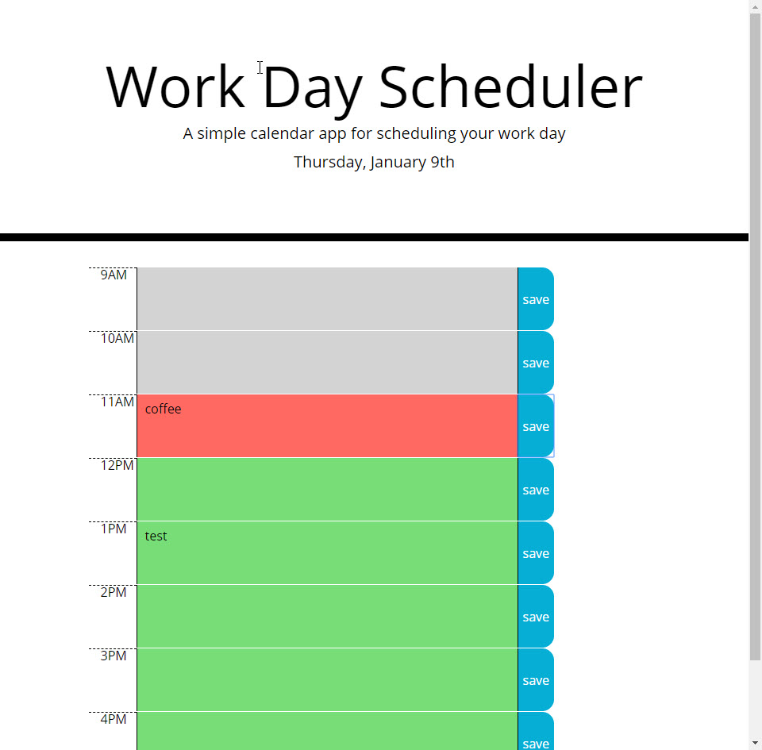

# Daily Planner
https://markspcs.github.io/homeworkWeek5/

## Description

This application launches with a with the view of the current day, or the next day if it's after 5PM in your current time zone

Simply enter any text in the hour rows, and click save for the row of which you've modifide 

This will save a list of current Days activities, and will delete them after the day is over.

## Installation

Requires style.css , script.js, and index.html to be in the current working directory. 

## Credits

This program includes bootstrap from http://getbootstrap.com 

